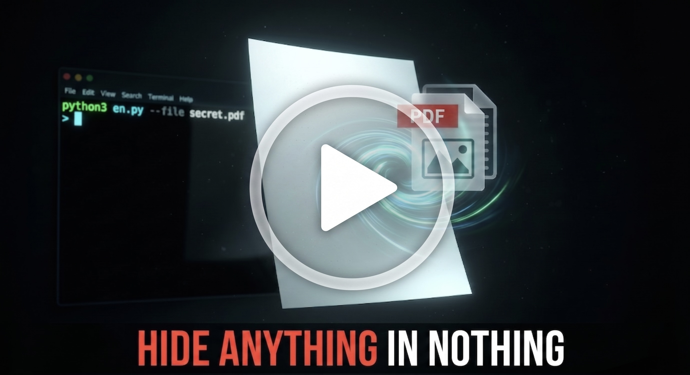

<div align="center">

# Project Invisible

<p align="center">
  <b>Hide anything inside nothing — Hide any file inside text that appears completely empty.</b>
</p>

<p align="center">
  <a href="https://python.org"></a>
  <a href="https://x.com/darkshadow2bd"></a>
  <a href="https://t.me/ShellSec"></a>
</p>

<br>

<p align="center">
  <a href="https://youtu.be/t4yTY0Cg6Ds" target="_blank">
    
  </a>
  <br>
  <em>▶ Click the image above to watch the how to use video on YouTube</em>
</p>

<br>

</div>

---

## What is Project Invisible?

**Project Invisible** is a Unicode steganography tool that hides **any file type** — images, videos, PDFs, documents, archives — inside text that appears **completely blank**.

The tool converts file bytes into zero-width Unicode characters (`U+200B`, `U+200C`, `U+200D`, `U+2060`). To the human eye the output looks like an empty string, but the original data is preserved byte-for-byte and can be fully recovered through decoding.

```
Original File  ->  Encoding  ->  Invisible Text (appears blank)
Invisible Text ->  Decoding  ->  Original File (byte-perfect)
```

### Encryption is Central

This is not just obfuscation. Every hidden payload can be **encrypted with AES-256-GCM** — the same standard used by governments and militaries worldwide. Without the correct password, the data is mathematically impossible to read. Encryption is built in as a first-class feature, not an afterthought.

### Capabilities

| Capability | Detail |
| :--- | :--- |
| **Stealth Communication** | Transmit hidden data through messengers, email, social media |
| **AES-256-GCM Encryption** | Password-protect payloads with authenticated military-grade encryption |
| **File Embedding** | Embed images, PDFs, videos, or any binary inside a `.txt` file |
| **Auto-Compression** | Automatic selection of Brotli / LZMA / Gzip for smallest output |
| **Header Auto-Detection** | Decoder reads the payload header and handles everything automatically |

---

## Quick Start

| Action | Command |
| :--- | :--- |
| Launch Desktop GUI | `python3 gui.py` |
| Encode text (CLI) | `python3 en.py "Your message" --save out.txt` |
| Decode back (CLI) | `python3 de.py out.txt` |
| Hide a file (CLI) | `python3 en.py --file document.pdf --name document.pdf --save out.txt` |
| Encrypt + hide | `python3 en.py --file document.pdf --encrypt --save out.txt` |

### Modern Desktop GUI

For an elegant, dark-themed native desktop experience supporting easy file selectors, text areas, password toggles, and responsive styling, run:
```bash
python3 gui.py
```

### Command Line Quick Start
```bash
# Encode and decode in two commands
python3 en.py "This is a highly classified secret." --save hidden.txt
python3 de.py hidden.txt
# Output: This is a highly classified secret.
```

---

## Requirements & Installation

### Requirement

- **Python 3.8+** (basic encoding/decoding works with zero dependencies)

### Installation Steps

```bash
# 1. Clone the repository
git clone https://github.com/darkshadow2bd/project-invisible.git
cd project-invisible

# 2. Create and activate a Python virtual environment
python3 -m venv venv
source venv/bin/activate          # macOS/Linux
# venv\Scripts\activate           # Windows

# 3. Install dependencies (required for encryption & Brotli compression)
pip install -r requirements.txt

# 4. Make scripts executable (Linux/macOS)
chmod +x en.py de.py

# 5. (Optional) Install globally for system-wide access
sudo cp en.py /usr/local/bin/eni
sudo cp de.py /usr/local/bin/dei
```

---

## Usage Guide

### Encoder (`en.py` / `eni`)

Encode plain text or files into invisible payloads.

```bash
python3 en.py [text] [options]
python3 en.py --file <path> [options]
```

| Flag | Description | Example |
| :--- | :--- | :--- |
| `--file <path>` | Target file to encode (any type) | `--file map.pdf` |
| `--save <file>` | Output file (default: `en_file.txt`) | `--save payload.txt` |
| `--name <file>` | Preset filename for automatic restoration on decode | `--name doc.pdf` |
| `--encrypt` | **Encrypt with AES-256-GCM** (prompts for password) | `--encrypt` |
| `--notime` | Skip size estimates for large files | `--notime` |

### Decoder (`de.py` / `dei`)

Decode invisible payloads back to original files. Supports Unix pipes.

```bash
python3 de.py <file> [options]
cat <file> | python3 de.py [options]
```

| Flag | Description | Example |
| :--- | :--- | :--- |
| `--save <file>` | Specify output file name | `--save output.pdf` |
| `--decrypt` | **Decrypt an AES-256-GCM payload** (prompts for password) | `--decrypt` |
| `--media` | Required for large media file recovery (safety measure) | `--media` |

---

## Examples

### Example 1: Basic Text
```bash
python3 en.py "Operation Midnight is a go."
python3 de.py en_file.txt
# Output: Operation Midnight is a go.
```

### Example 2: Encrypted Document with Preset Name
```bash
# Encode with encryption
python3 en.py --file blueprints.docx --name blueprints.docx --encrypt --save secret.txt

# Decode (prompts for password, auto-restores as 'blueprints.docx')
python3 de.py secret.txt --decrypt
```

### Example 3: Image
```bash
# Encode an image
python3 en.py --file evidence.jpg --name evidence.jpg

# Decode (--media flag required for large media files)
python3 de.py en_file.txt --media --save evidence.jpg
```

---

## How It Works

| Step | Process | Purpose |
| :--- | :--- | :--- |
| 1. Compress | Brotli / LZMA / Gzip (auto-selected) | Reduce payload size |
| 2. **Encrypt** | **AES-256-GCM with PBKDF2 key derivation** | **Protect data with authentication** |
| 3. Convert | Each byte -> 4 invisible Unicode characters | Make data invisible |
| 4. Output | Save as text file with magic header | Enable auto-decoding |

---

## Encryption Architecture (AES-256-GCM)

Encryption is the backbone of secure payload hiding. Here is exactly how it works:

| Component | Specification |
| :--- | :--- |
| **Algorithm** | AES-256 in Galois/Counter Mode (GCM) |
| **Authentication** | GCM provides authenticated encryption — detects any tampering |
| **Key Derivation** | PBKDF2-HMAC-SHA256 with **1,000,000 iterations** |
| **Salt** | Random 16-byte salt per encryption (unique every time) |
| **Nonce** | Random 12-byte nonce per encryption |
| **Output Uniqueness** | Same file + same password -> completely different output each time |
| **Dependency** | Requires `cryptography` library (included in `requirements.txt`) |

> Without the correct password, decryption is computationally infeasible. The 1,000,000 PBKDF2 iterations make brute-force attacks extremely slow.

---

## Compression Engine

The encoder tests multiple algorithms and selects the one producing the smallest output:

| Engine | Typical Savings | Notes |
| :--- | :--- | :--- |
| **Brotli** | 75-95% | Best compression ratios (requires `pip install brotli`) |
| **LZMA** | 80-90% | Aggressive compression, built into Python |
| **Gzip** | 70-85% | Fast, reliable, built into Python |

---

## Encoding Internals

1. **Binary Splitting**: Each byte is split into 4 pairs of 2 bits (`00`, `01`, `10`, `11`)
2. **Unicode Mapping**: Each 2-bit pair maps to a zero-width character:
   - `00` -> Zero Width Space (ZWSP, `U+200B`)
   - `01` -> Zero Width Non-Joiner (ZWNJ, `U+200C`)
   - `10` -> Zero Width Joiner (ZWJ, `U+200D`)
   - `11` -> Word Joiner (`U+2060`)
3. **Header**: Payload includes `[3-byte magic] [algorithm] [flags] [filename length] [filename bytes] [payload]`
4. **Auto-Detection**: The decoder reads the header and automatically handles legacy and modern payload formats

---

## Limitations

| Limitation | Detail |
| :--- | :--- |
| **Size Expansion** | Output is ~4x larger than original (compression reduces this for compressible data) |
| **Clipboard Limits** | Encoding up to ~200MB works, but pasting very large payloads may freeze OS clipboards and editors |
| **Sanitization** | Most apps (browsers, Telegram, WhatsApp) preserve zero-width characters; some strict sanitizers may strip them |
| **Encryption Dependency** | AES-256-GCM requires `cryptography` — install via `pip install -r requirements.txt` |

---

## Contributors

Project Invisible is built and maintained by:

| Role | Name | GitHub | Links |
| :--- | :--- | :--- | :--- |
| **Original Author & CLI Engine** | DarkShadow | [@darkshadow2bd](https://github.com/darkshadow2bd) | [X @darkshadow2bd](https://x.com/darkshadow2bd) · [Telegram ShellSec](https://t.me/ShellSec) |
| **Windows Native GUI Contributor** | Imran Hossain | [@ImranVibes](https://github.com/ImranVibes) | — |

---

## Connect

**Author:** DarkShadow

| Platform | Link |
| :--- | :--- |
| **X (Twitter)** | [@darkshadow2bd](https://x.com/darkshadow2bd) |
| **Telegram** | [ShellSec](https://t.me/ShellSec) |

---

<div align="center">
  <b>Project Invisible</b> — What you see is not what you get.<br><br>
  Made with ❤ by <a href="https://github.com/darkshadow2bd">DarkShadow</a> &amp; <a href="https://github.com/ImranVibes">Imran Hossain</a>
</div>
